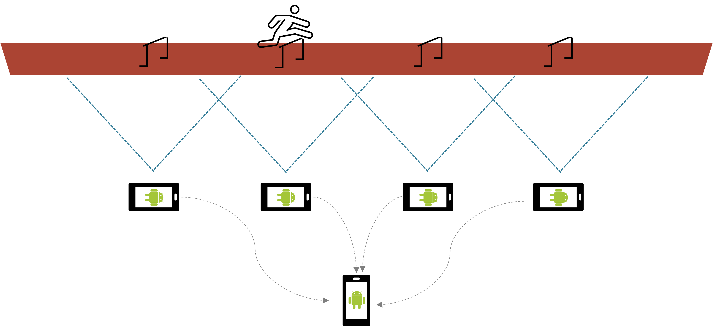
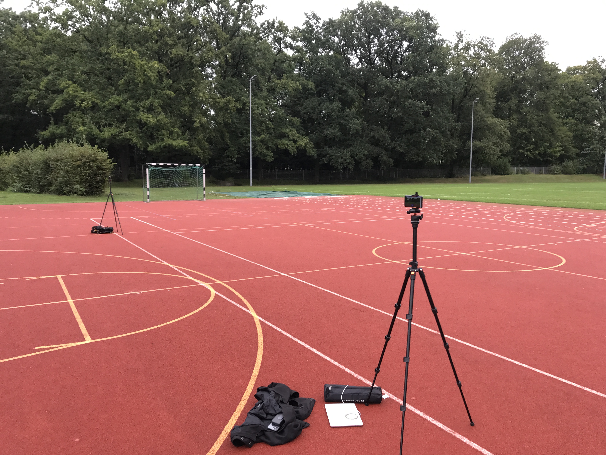

# Runalyzer

Diese Android Applikation ermöglicht Benutzern, ein Video zu zu erstellen, mit dem eine Bewegungsanalyse von Läufern möglich ist. Durch die Positionierung mehrerer Mobiltelefone entlang einer Laufstrecke, die abschnittsweise Aufnahme von Laufvideos und die anschließende automatisierte Verarbeitung der Videos zu einem finalen Video mit zentriertem Läufer soll eine Laufanalyse von Athleten möglich sein. Wie in der folgenden Abbildung dargestellt, können beliebig viele Geräte entlang einer Strecke positioniert werden. Wichtig ist dabei ein Überlappungsbereich zwischen den Sichtfeldern zweier benachbarter Kameras. Diese Geräte senden ihre aufgenommenen Videos an ein zentrales Gerät, das daraus mithilfe von Objekterkennungsalgorithmen ein finales Video erstellt, in dem der Läufer stets im Mittelpunkt ist.

Die Mobiltelefone sollten auf Stativen wie in folgendem Aufbau positioniert werden.

Beim Aufnehmen des Läufers über die "Record Video"-Funktion auf dem Telefon stellen Sie bitte sicher, dass jedes Video nicht länger als 60 Sekunden ist, da längere Videos zu einem erheblichen Qualitätsverlust im Endergebnis führen.

Beim Erstellen der Videokompilation denken Sie daran, den Zeitcode einzugeben, der im Namen der Videodatei gespeichert wurde.

Im Repository finden Sie auch eine [Bildschirmaufnahme](path/to/video.mp4), die zeigt, wie die Anwendung verwendet werden sollte.

Um die Applikation erfolgreich auf einem Android-Gerät zu starten, müssen folgende Anweisungen beachtet werden:

## Schritt 1
 Installieren Sie Android Studio unter: [https://developer.android.com/studio](https://developer.android.com/studio).  
In diesem Projekt wurde mit folgender Version von Android Studio gearbeitet: **Android Studio Jellyfish | 2023.3.1 Patch 1**.

## Schritt 2
Klonen Sie das GitHub-Projekt lokal auf Ihrem Rechner. Öffnen Sie es anschließend mit Android Studio.

## Schritt 3
Importieren Sie das Modul für die OpenCV-Bibliothek in das Projekt. Hierbei können Sie dieser [OpenCV-SDK Anleitung](https://medium.com/@sdranju/android-studio-step-by-step-guide-for-setting-up-opencv-sdk-4-9-on-android-740547f3260b) folgen.

## Schritt 4
 Aktivieren Sie die Entwickleroptionen auf dem Android-Gerät über folgende [Anleitung](https://developer.android.com/studio/debug/dev-options?hl=en).  
 Anschließend verbinden Sie das Gerät mit Android Studio basierend auf folgendem [Tutorial](https://developer.android.com/studio/run/device?hl=en).

**Nach Abschluss aller Schritte kann die Applikation auf dem Gerät getestet werden.**
